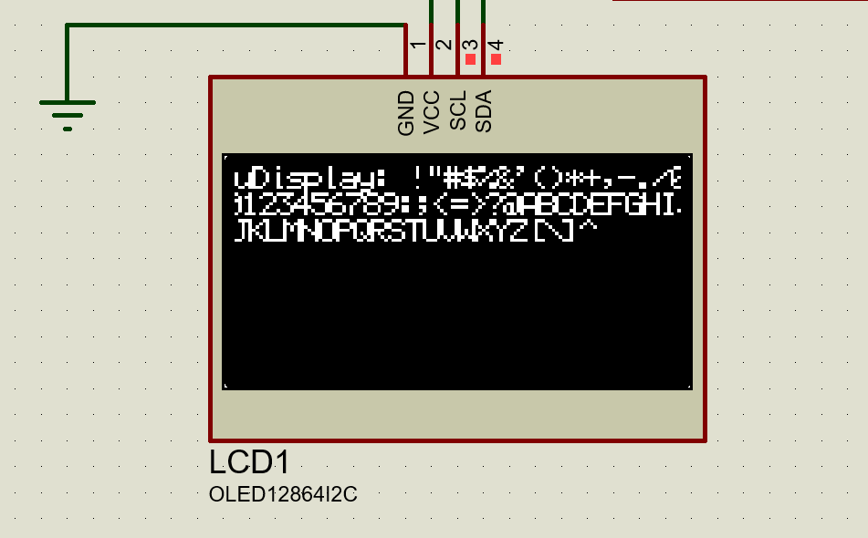

# uDisplay

2D Display controller library for low spec MCU'S
________________________________________________


### Key features

* Intented to run on many embbed c compilers
* Lightweight/Portable implementation using only C and CMake
* Buffer-less rendering (main library goal)
* Generated header only library 
* I2C and SPI Hardware/Software implementations

## Example

* Initialze uDisplay
```c
//Configures uDisplay renderer with software 
uDRenderConfig config = { &uDisplay_UnderlyingProtocol_I2C_Software, &uDisplay_SSD1306Driver };

//Configures the underlying comunication ports and address (0x78) in this case
uDisplay_UnderlyingProtocol_I2C_Software.configure(0x78);

//Initialize the driver (internal initialization)
uDisplay_UnderlyingProtocol_I2C_Software.init();
uDisplay_SSD1306Driver.Init(&uDisplay_UnderlyingProtocol_I2C_Software);

//Configures uDisplay rendering
uDisplayRenderer.Initialize(&config);
```

* Text rendering example

```c
//Set font data
uDBufferDescriptor testFont;
testFont.data = uD_DefaultFont;
testFont.dataLenght = sizeof(uD_DefaultFont);
fontMeta.height = 8; // 8 bits tall font
testFont.width = 5; //  5 bits wide font

//Set as current font
uDisplayRenderer.SetFont(&testFont);

//Draws an string
uDisplayRenderer.DrawString("uDisplay:");

//Draws all font characters
uint8_t charIndex = 32;
const uint8_t fontLenght = sizeof(uD_DefaultFont) / testFont.width;
for (; charIndex < fontLenght; charIndex++)
{
  uDisplayRenderer.DrawChar(charIndex);
}
```

#### Running example on attiny85

* Check uDisplayTest.c for more detailed examples

## Getting Started

* Configure the [CMakeLists.txt]() to compile as an example or lib (genererates a .o or a only header version)
```cmake
set(MCU  "attiny85")
set(ARCH "AVR")
```

## Dependencies
* CMake
* avr-gnu toolchain
* avrdude

```bash
sudo apt-get install avr-libc avrdude gcc-avr binutils-avr gdb-avr
```
#### Ubuntu:

```bash
sudo apt-get install gcc-avr binutils-avr gdb-avr avr-libc avrdude
```
## Installing

* [See installation guide for avr]() 
* [See installation guide for pic]() 


* How to run the program
* Step-by-step bullets
```
code blocks for commands
```
## uDisplay drivers

| DISPLAY CONTROLLER| ARCH  | STATUS       |
|-------------------|-------|--------------|
| SSD1306           | I2C   | WIP          |
| ST7789            | SPI   | WIP          |
| ST7735R           | SPI   | WIP          |

## uDisplay MCU compatibility

| MCU             | ARCH  | STATUS       |
|-----------------|-------|--------------|
| ATmega328P      | AVR   | DEVELOPMENT  |
| ATTiny85        | AVR   | DEVELOPMENT  |
| AT89S52         | 8051  | DEVELOPMENT  |
| PIC16F877A      | PIC   | DEVELOPMENT  |
| STM32F103C8T6   | ARM   | DEVELOPMENT  |

## uDisplay road map

* 1.0 (WIP)
    * Basic batch rendering
    * Dedicated frame buffer or bufferles rendering 
    * Helper  rendering functions (generic display built-ins)
      - Clear display
      - Rendering regions (colum and pages configuration)
      - Content scrolling
    * Basic in-memory font rendering
    * Device compatibility
      - ATTINY85
      - ATMEGA328P
    * Display drivers
      - SSD1306
      - SST7789
    *  uDisplay benchmarking module
      - FPS indicator
      - Latency indicator
    * Header only library (Generated)

* 1.1 (FUTURE-RELEASE)
    *  AVR C code optimizations
    *  Display drivers
        - ILI9341
    * Touch drivers module
        -  ILI9341 touch screen driver
    * Device compatibility
        - STM32 (ARM CORTEX M0)
    * Multiple Screens running on the same library instance (uDisplay factory)

#### OPTIONAL FEATURES

* 1.X (FUTURE-RELEASE)
  * Video rendering
     - too complex??? idk, let's find out...
  * Pseudo threads for uDisplay (uThreads library)
    - Software implementation
    - Harware implementation using timmers and interrupts

## Authors and 

- xul (54UL)

## Resources used to implement uDisplay (REFERENCES)
- [AVR Optimization tips and tricks] (https://ww1.microchip.com/downloads/en/AppNotes/doc8453.pdf)
- [Open GL pixmap fonts rendering] (https://courses.cs.washington.edu/courses/cse457/98a/tech/OpenGL/font.c)
